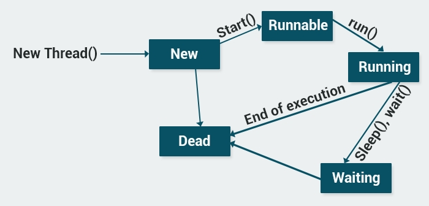

**Threads**

**The following diagram shows the life-cycle of a thread.**

There are two ways to create a thread.

**1. Extend the Thread class**
Inherit from the **Thread **class, override its  **run** **() method, and write the functionality of the thread in the**  **run** **() method.**
Then you create a new object of your class and call it's **start **method to run the thread.

**As you can see, our Loader class extends the Thread class and overrides its** **run() **method.
When we create the **obj **object and call its  **start** **() method, the**  **run** **() method statements execute on a different thread.**

⚠ **Every Java thread is prioritized to help the operating system determine the order in which to schedule threads. The priorities range from 1 to 10, with each thread defaulting to priority 5. You can set the thread priority with the**  **setPriority** **() method.**

**The other way of creating Threads is**  **implementing the Runnable interface** **.**
Implement **the **run() method. Then, create a new Thread object, pass the Runnable class to its constructor, and start the Thread by calling the  **start** **() method.**

**The** **Thread.sleep()** **method pauses a Thread for a specified period of time. For example, calling** **Thread.sleep(1000);** **pauses the thread for one second. Keep in mind that**  **Thread.sleep(** **) throws an InterruptedException, so be sure to surround it with a** **try/catch **block.

⚠ It may seem that implementing the Runnable interface is a bit more complex than extending from the Thread class. However, implementing the Runnable interface is the preferred way to start a Thread, because it enables you to extend from another class, as well.

# LinkedList vs. ArrayList

**⚠ Summary:**

- Use an **ArrayList **when you need rapid access to your data.
- Use a **LinkedList **when you need to make a large number of inserts and/or deletes.
